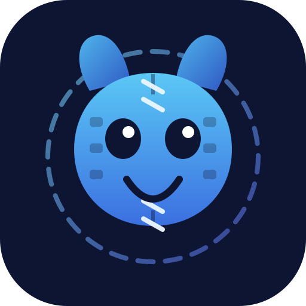

<p align="center">
  
</p>

<h1 align="center">Stitch</h1>

<p align="center">
  A self-hosted Discord bot that collects your community's gaming clips, throws away the
  duplicates, and sews the rest into one video on YouTube — weekly, or whenever twenty
  pile up. Your server, your channel, your clips.
</p>

<p align="center">
  
  
  
  
</p>

---

## Why "Stitch"?

Because that is literally the job. Twenty ragged little clips go in; one seamless reel
comes out. Every crossfade is a stitch, the reel is the quilt, and `ffmpeg` is the
sewing machine that does the actual needlework at three in the morning while you sleep.

We considered calling it Quilt. Nobody wants to tell their friends about a Discord bot
called Quilt.

It also fits the temperament. The bot takes a pile of chaotic, badly-behaved little
monsters that have nothing in common — different resolutions, different frame rates,
one of them has no audio at all, one of them is somehow 4:3 — and patiently makes them
into a family. Nothing gets left in the queue.

Any resemblance to a small blue alien is a coincidence, and the mascot above is his own
creature: he is made of film strips and held together by his own seam, which is more
than most of us can say.

---

## What it does

```
#gaming-clips ──▶ ingest ──▶ dedupe ──▶ queue
                                          │
                        20 clips  or  weekly cron
                                          ▼
                        normalize ──▶ stitch with crossfades
                                          ▼
                    YouTube (private) ──▶ link posted back to Discord
```

- **Watches a channel** for uploaded videos and links to clip hosts. Images, screenshots
  and chatter are filtered out before anything is downloaded.
- **Refuses duplicates** three different ways, including a perceptual fingerprint that
  catches the same clip re-uploaded through a different capture tool.
- **Normalizes everything** to one resolution, frame rate and loudness, so twenty
  mismatched sources cut together cleanly.
- **Uploads to YouTube** with a generated thumbnail, title and description — private by
  default, because publishing should be a decision.
- **Runs on a small box.** Peak memory is a tuning knob, not a surprise.

---

## Quick start

```bash
git clone https://github.com/alsmadi99/stitch.git
cd stitch
npm install
cp .env.example .env
```

Fill in `DISCORD_TOKEN`, `DISCORD_APP_ID`, `CLIPS_CHANNEL_ID` and `ADMIN_USER_IDS`, then:

```bash
npm run doctor
```

`doctor` checks every integration point — env file, ffmpeg, yt-dlp, database, Discord
login, channel permissions, the privileged intent, and the YouTube token — and changes
nothing. Fix whatever it reports, then:

```bash
npm run dev
```

Leave the YouTube variables blank to run in local-only mode: reels are compiled to
`data/out/` and nothing is uploaded. It is the best way to see what the output looks
like before pointing it at a real channel.

### Discord setup

1. Create an application, add a bot, copy the token and application ID.
2. **Bot → Privileged Gateway Intents → enable Message Content Intent.** Without it,
   attachments arrive empty and the bot silently collects nothing.
3. Invite it with the `bot` and `applications.commands` scopes and these permissions:
   View Channel, Send Messages, Embed Links, Read Message History, Add Reactions.
4. Turn on Developer Mode in Discord, then right-click the channel and your own name to
   copy the IDs for `CLIPS_CHANNEL_ID` and `ADMIN_USER_IDS`.

### YouTube setup

1. Enable **YouTube Data API v3** in a Google Cloud project. It is free and needs no
   billing account.
2. Create an OAuth client of type **Web application** with
   `http://localhost:8787/oauth2callback` as an authorized redirect URI.
3. Set the app's publishing status to **In production**. Left in *Testing*, Google
   invalidates the refresh token every seven days.
4. Fill in `YOUTUBE_CLIENT_ID` and `YOUTUBE_CLIENT_SECRET`, then run
   `npm run youtube:auth` and paste the printed token into `.env`.

Run that consent flow on your laptop. The bot authenticates with the refresh token and
never receives a redirect, so the redirect URI does not change when you deploy.

---

## Commands

| Command | Who | What |
| --- | --- | --- |
| `/clips status` | `ADMIN_ROLE_IDS` | Queue size, whether a reel is compiling, last reel |
| `/reel build` | `ADMIN_USER_IDS` | Compile now, ignoring the threshold |
| `/reel publish` | `ADMIN_USER_IDS` | Attempt to make the latest reel public |

```bash
npm run backfill          # walk the entire channel history and reel it all
npm run backfill:status   # check on it from anywhere
npm run backfill:stop     # ask a running backfill to stop at its next checkpoint
npm run doctor            # verify every integration point
npm run reel:now          # compile and upload immediately
npm run rebuild -- --episode 8   # rebuild episode #8 from its original clips
npm run rebuild -- --episode 8 --yes --detach   # ... in the background, survives a closed terminal
npm run youtube:cleanup   # delete videos this bot uploaded
```

**Backfill is deliberately not a Discord command.** It walks the whole channel,
downloads gigabytes and uploads several videos against a quota that allows six a day.
One mistaken invocation costs a day of uploads and cannot be recalled.

### Vetoing a clip

React with ❌ on any clip and it leaves the queue — it will not appear in this reel or
any later one. The bot swaps its ✅ for 🚫 so the state is visible in the channel.
Remove the reaction to put it back.

`VETO_ALLOWED` in `src/constants.ts` decides who it obeys. `ADMIN_USER_IDS` always
works; the setting only widens the circle.

| `VETO_ALLOWED` | you | a mod with Manage Server | the clip's author | anyone else |
| --- | --- | --- | --- | --- |
| `owner` (default) | yes | no | no | no |
| `admins` | yes | yes | no | no |
| `authors` | yes | yes | yes | no |

A reaction is not a permission check in itself — anyone who can see the channel can add
one — so the bot decides who it listens to and ignores the rest.

---

## How it works

### Three layers of duplicate detection

1. **Message identity.** A `UNIQUE (message_id, source_url)` constraint, so restarts and
   overlapping backfills never re-ingest the same post.
2. **SHA-256 of the bytes.** Catches the same file reposted verbatim.
3. **Perceptual fingerprint.** Five frames sampled at 10/30/50/70/90% of the clip, each
   reduced to a 64-bit dHash. Two clips match when their mean Hamming distance is under
   `phashThreshold` in `src/constants.ts` (default 8).

Layer 3 is the one that earns its keep: it catches a clip re-uploaded through Medal, or
trimmed and recompressed by a different capture tool. Measured on synthetic footage, a
clip rescaled to half resolution at CRF 34 scored **0.8** against its original while
unrelated footage scored **22–38** — a wide margin either side of the threshold.

### Timing, and why it is fussy about it

Every timing decision comes from the source's **video stream**, never the container. A
container reports its longest stream, and screen recorders routinely emit audio that
runs past the picture. Timing a reel off that number asks ffmpeg for frames that do not
exist, and it fills the gap by freezing the last one — a 5.0s video with a 5.8s audio
track produced an 800ms stall at the end of that clip.

Each normalized clip is then pinned to one frame-aligned duration on **both** streams,
because video lands on frame boundaries while audio lands on AAC boundaries that
`loudnorm` has also lengthened.

Stitching places audio explicitly rather than using `acrossfade`. Chained across a
batch, `acrossfade` builds an audio timeline roughly 1024 samples (~21ms at 48kHz)
shorter per join than `xfade` builds for video — so sound slides further ahead of
picture at every single join. Instead, each segment's audio is delayed to the exact
offset its video uses and summed with `amix`, which makes the two agree by construction.

Measured with clips carrying a white flash and a 1kHz beep at the same instant, then
compared with `blackdetect` against `silencedetect`:

| | first marker | last marker | worst |
| --- | --- | --- | --- |
| `acrossfade` | +3ms | −321ms | **−323ms**, growing every join |
| explicit timeline | +3ms | −44ms | **−44ms**, not accumulating |

The residual is bounded rather than progressive, which is the part that matters: it does
not get worse as a reel gets longer.

### Memory does not scale with the reel

Reels are assembled from pieces rather than joined as wholes:

```
body₀ · transition₀ · body₁ · transition₁ · … · bodyₙ
```

Every ffmpeg call handles **one clip**, or **two half-second inputs** for a transition,
so nothing ever holds more than a fraction of a second of video. Audio is built in one
separate pass with `-vn`; audio frames are kilobytes, so every clip can be open at once.

This replaced a design that fed `xfade` two long segments and asked it to blend at the
end. That buffered roughly the whole crossfade offset as decoded frames — 2772MB
measured against 66s x 30fps x 1.4MB — and no batch size or resolution avoided it,
because the offset grows with the reel however the joins are arranged.

Measured on a 20 clip, 3.7 minute reel from mixed 480p/720p/1080p/1440p sources, inside
a container capped at 1536MB:

| | 720p | 1080p |
| --- | --- | --- |
| Peak memory | 253 MB | 506 MB |
| Compile time | 64 s | 105 s |
| Worst A/V offset | 167 ms | 167 ms |

The A/V offset fluctuates rather than accumulating, which is the property that matters:
it does not get worse as a reel gets longer.

### The thumbnail

Every episode gets a generated 1280x720 thumbnail with the same furniture, so the
playlist reads as a series: an accent badge with `#N`, an accent rule, and a darkened
band carrying `THUMBNAIL_LABEL`.

The background is not a fixed-offset frame grab — that reliably lands on a loading
screen or a dark corner. Twenty-four frames are sampled across the finished reel, scored
on colourfulness, contrast and distance from a mid-tone exposure, and the winner wins.

---

## Deploying

```bash
docker compose up -d --build
```

The image is Debian-based on purpose: `better-sqlite3` ships glibc prebuilds, and the
distro `ffmpeg` has the `drawtext` filter that the static build lacks. It also installs
`yt-dlp` and a font for the thumbnail text.

`docker-compose.yml` is sized for a small host — a 1536 MB limit against a measured
~1.2 GB peak, with `cpu_shares` set low so a long encode yields to everything else. A
commented 720p block halves it.

State lives in the `stitch-data` volume: the database, downloaded clips and finished
reels. **That volume is the only state — back it up.**

```bash
docker run --rm -v stitch_stitch-data:/data -v "$PWD:/backup" \
  alpine tar czf /backup/stitch-data.tar.gz -C /data .
```

A named volume rather than a bind mount, because the container runs unprivileged and a
bind-mounted host directory arrives owned by root. The entrypoint handles that case too
if you prefer a host directory.

### Quota, and why a big history takes days

YouTube allows 10,000 quota units a day and charges 1,600 per upload. **Six uploads a
day is a hard ceiling** — the seventh fails no matter how the bot is configured. A
200-clip history is ten reels, so it takes two days minimum.

The bot keeps going anyway without you: it builds ahead, holds finished reels as
`pending_upload`, uploads them hourly as quota frees up, and resumes the scan by itself
once the backlog drains. One `npm run backfill` eventually publishes the whole channel.

| Failure | Retried | Backoff |
| --- | --- | --- |
| `quotaExceeded`, `rateLimitExceeded` | yes | 6 hours |
| 5xx, `ECONNRESET`, timeouts | yes | 5 min, doubling, capped at 2 h |
| 403, 401, 400 | no | fails immediately |

A rejected video fails identically forever, so retrying it only burns quota.

---

## Gotchas worth knowing

- **`YOUTUBE_PRIVACY` only applies when `YOUTUBE_AUTO_PUBLISH=true`.** With auto-publish
  off — the default — every upload is created private regardless. The two used to be
  independent, which made `PRIVACY=public` with `AUTO_PUBLISH=false` read as safe and
  publish everything on upload.
- **Unverified Google Cloud projects can only upload private videos.** The API accepts
  `public` and locks the video private anyway, and `/reel publish` returns 403.
- **YouTube cannot replace a video's file.** A corrected reel is always a new link, so a
  bad batch has to be deleted with `npm run youtube:cleanup` and rebuilt. Run that
  *before* `backfill --restart`, which wipes the record of which videos are the bot's.
- **`#` in a `.env` value starts a comment.** dotenv drops everything after an unquoted
  `#`, so wrap values containing one in double quotes.
- **Videos over 15 minutes need a verified channel.** Twenty clips at the 60s cap is a
  20-minute reel. `doctor` checks this.
- **Monetization cannot be enabled through the API.** It is a channel-level setting in
  YouTube Studio; the bot only ensures `selfDeclaredMadeForKids` is false.
- **Copyright.** Clips with game soundtracks can pick up Content ID claims. That is a
  channel-policy problem, not something the bot can detect.
- **Consent.** The bot reposts members' clips publicly. Say so in the channel topic.

---

## Configuration

Configuration is split in two, on one rule: **`.env` is for things two installations
disagree about — secrets, ids, and what the host can afford. Everything else lives in
`src/constants.ts`.** That keeps `.env` down to about thirty lines instead of sixty.

`.env.example` documents every variable. The ones you are most likely to touch:

| Variable | Default | Notes |
| --- | --- | --- |
| `REEL_MAX_CLIPS` | `20` | Threshold that fires a reel immediately |
| `REEL_CRON` | `0 18 * * 0` | Sunday 18:00, honours `TZ` |
| `OUTPUT_WIDTH` / `OUTPUT_HEIGHT` | `1920`/`1080` | 720p halves memory and encode time |
| `OUTPUT_FPS` | `30` | 60 doubles encode time; memory is unaffected |
| `MAX_CLIP_SECONDS` | `60` | Longer clips are trimmed |
| `FFMPEG_THREADS` | `0` | 0 = all cores; set it on a shared host |
| `YOUTUBE_AUTO_PUBLISH` | `false` | `true` uploads at `YOUTUBE_PRIVACY` |
| `LINK_ALLOWED_USER_IDS` | empty | Empty means anyone may post a link |

In `src/constants.ts`, edit and rebuild:

| Setting | Default | Notes |
| --- | --- | --- |
| `VETO_ALLOWED` | `owner` | Who the ❌ reaction obeys |
| `ingest.phashThreshold` | `8` | Raise to catch more duplicates |
| `ingest.maxLinkBytes` | 60MB | Cap for links; attachments use `maxDownloadBytes` |
| `ingest.extractorArgs` | empty | yt-dlp `--extractor-args`, if YouTube blocks you |
| `youtube.tags` / `hashtags` | a gaming set | Your channel's SEO terms |

---

## Layout

```
src/
  config.ts      env parsing and validation, creates data dirs
  constants.ts   settings that are decisions, not deployment details
  pipeline.ts    select clips → compile → upload → announce, with the run lock
  drain.ts       full-history backfill driven into 20-clip reels
  jobs.ts        one-slot job queue so long runs live in the bot, not a terminal
  db/            SQLite schema and the clips/reels repositories
  discord/       client, collector, commands, veto reactions, announcements
  ingest/        download, probe, hashing and fingerprinting
  video/         ffmpeg runner, normalize, stitch, thumbnail
  youtube/       OAuth, metadata, resumable upload with retry
scripts/         doctor, backfill, youtube-auth, youtube-cleanup, healthcheck
```

---

## Contributing

Issues and pull requests are welcome — see [CONTRIBUTING.md](CONTRIBUTING.md). The
short version: `npm run typecheck && npm run lint` before you push, and if you touch
the video pipeline, measure the thing you changed.

## License

MIT. See [LICENSE](LICENSE).
